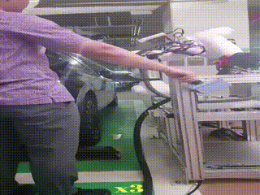

## Electric Vehicle Charge Inlet Detection Network  전기차 로봇 자동 충전 시스템

 

### **프로젝트 소개**  

운전자의 개입없이 전기차를 충전할 수 있는 시스템.  
최근 전기차 고속 충전 서비스가 본격 확산되면서 안전하고 편리한 서비스를 위한 로봇 기반 자동 충전 서비스에 대한 요구가 커지고 있습니다.  
로봇 기반 자동 충전 서비스는 운전자의 개입 없이 전기차 충전을 가능케 하여 전자파 노출과 고하중의 충전 케이블로 인한 부상을 방지할 수 있으며 충전소의 필요 인력을 최소화할 수 있습니다. 

소개하는 동영상의 자동 충전 로봇 시스템은 인공지능 기반 3D 비전 솔루션으로부터 인식된 충전 인렛의 위치와 방향에 따라 협동 로봇이 충전 커플러를 획득,  충전 인렛의 위치로 장애물을 회피하여 안전하고 신속하게 이동, 체결 및 분리하는 작업을 수행합니다.  

 

### 비디오

 

 

___
## **공동연구**

- 서울과학기술대학교, 전기정보공학과, 이영일 교수님 연구실  [DCSL(Digital Control System Lab.)](http://mpc.seoultech.ac.kr/)  

- 서울과학기술대학교, 전자공학과, 강병근 교수님 연구실  [MVL(Machine Vision Lab.)](https://visionlab.seoultech.ac.kr/index.do)

